# 智汇校园 · 一站式智慧校园服务平台

> **毕业设计（论文题目）**：《基于云边协同与 Serverless 架构的"智汇校园"一站式服务平台设计与实现》
>
> 基于腾讯云 EdgeOne **云边协同全栈架构**的校园综合服务平台 · 单套代码同时适配桌面端与移动端

**在线地址**：<https://c.9o.pw>　|　**技术栈**：Vue 3 · Element Plus · EdgeOne Pages（Edge + Node Functions）· TiDB Cloud Serverless

**项目规模**：33 张数据表 · 11 个 schema · 43 个 Serverless 函数文件 · 24 个前端页面 · 约 1.4 万行源码 · 80 条单元测试 + 56 项线上冒烟

---

## 目录

- [一、项目简介](#一项目简介)
- [二、界面预览](#二界面预览)
- [三、功能清单](#三功能清单)
- [四、技术栈](#四技术栈)
- [五、系统架构](#五系统架构)
- [六、数据库设计](#六数据库设计)
- [七、部署方式](#七部署方式)
- [八、测试与质量保障](#八测试与质量保障)
- [九、演示账号](#九演示账号)
- [十、开发文档索引](#十开发文档索引)

---

## 一、项目简介

一个覆盖校园生活全场景的一站式平台：在**统一认证与五角色权限体系**之下，集成教务（选课 / 成绩 / 排课）、学工（请销假 / 公告）、宿舍管理（分配 / 报修）、校园邮箱、图书借阅、失物招领、社团活动、校园论坛（含二手交易）、站内信与**数据驾驶舱**等 12 个功能域。

区别于单个业务管理系统，本项目的核心卖点是 **统一架构 + 模块化设计 + 云边全栈部署**：

| 特点 | 说明 |
|---|---|
| **云边协同** | 静态资源与轻量统计走全球边缘节点（3200+），强一致事务走云端 Node Functions——不是"把服务搬到云上"，而是按能力边界分工 |
| **全栈 Serverless** | 除数据库外无任何需要自运维的服务器；Git 推送即构建部署，全流程约 3 分钟 |
| **零额外依赖的响应式** | 同一套 Vue 构建产物，桌面宽屏与移动窄屏两套布局；移动端适配层与桌面样式完全隔离（见 §5.4） |
| **模块化不靠复制** | 新增审批类业务只需建业务表 + 插流程实例，不写流程代码（见 §5.4 审批流引擎） |
| **可验证的工程质量** | 一条 `npm run check` 跑完 lint → 80 单测 → 数据体检 → 56 项线上冒烟；线上真实环境而非本地演示 |

---

## 二、界面预览

### 2.1 落地页（首页）

左侧文案 + 右侧真实界面预览的双栏 Hero，下方为平台数据带与 9 个服务模块矩阵（桌面端 3×3 满格）。

<p align="center">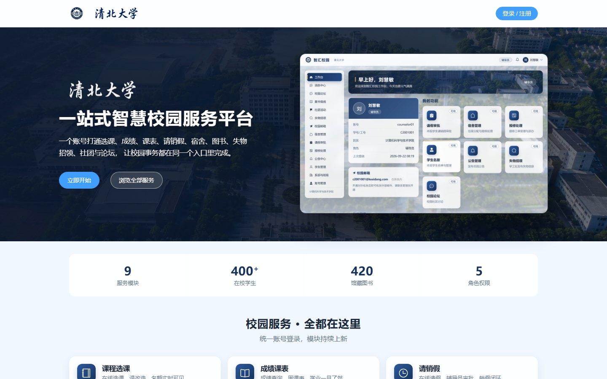</p>

### 2.2 移动端

移动端不是简单缩放：顶栏收起为「汉堡 + 校徽 + 铃铛 + 头像」，侧边栏改为抽屉菜单，表单标签上置、对话框全宽、表格横向滚动、卡片单列铺满。

<p align="center">
  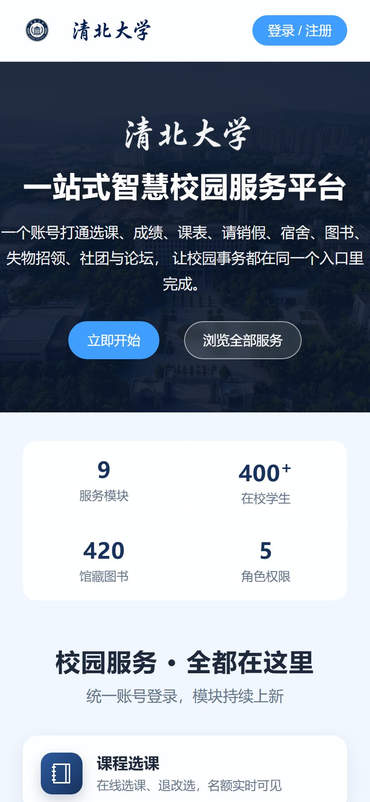
  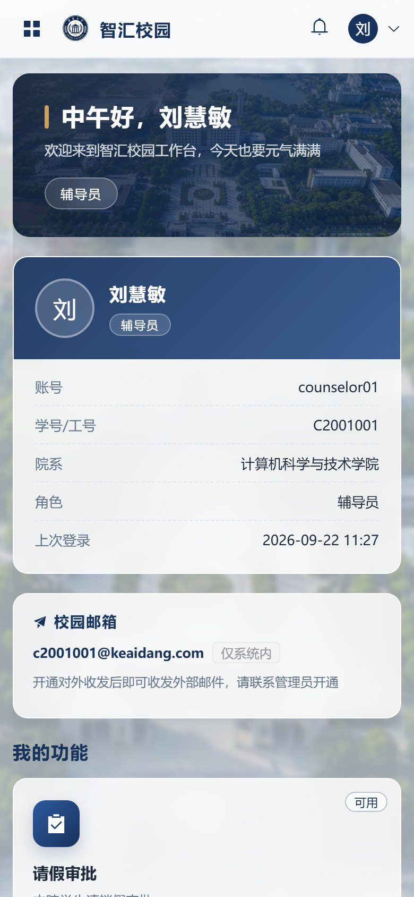
  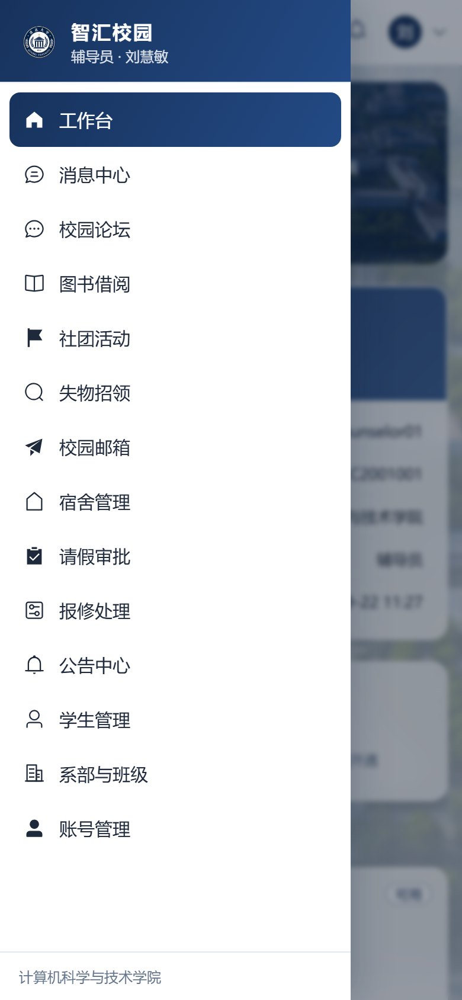
</p>

### 2.3 工作台与数据驾驶舱

工作台按角色渲染功能入口与个人名片；数据驾驶舱面向校领导与管理员，聚合全校运行态势（用户 / 教务 / 学工 / 宿舍 / 生活服务 / 登录趋势 / 管理动态），**纯 CSS 图表零图表库依赖**。

<p align="center">
  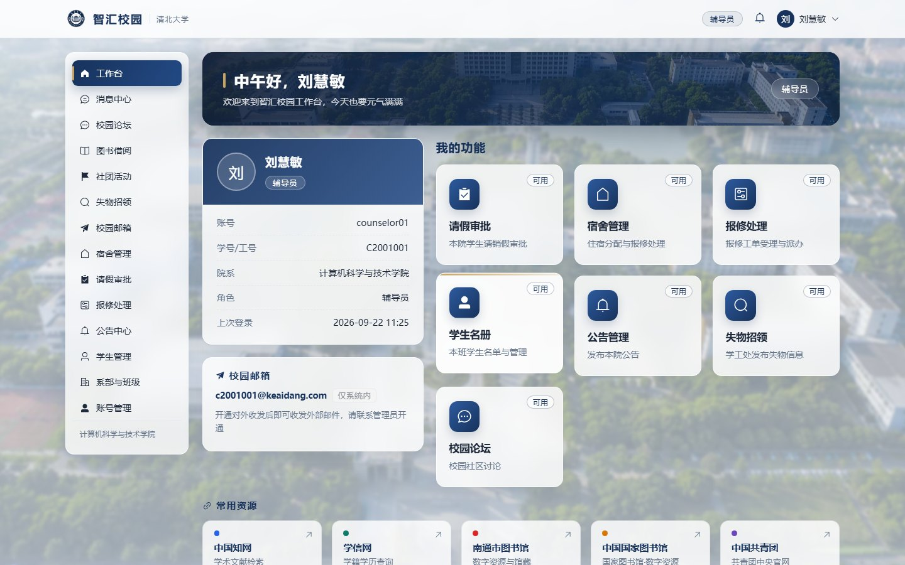
  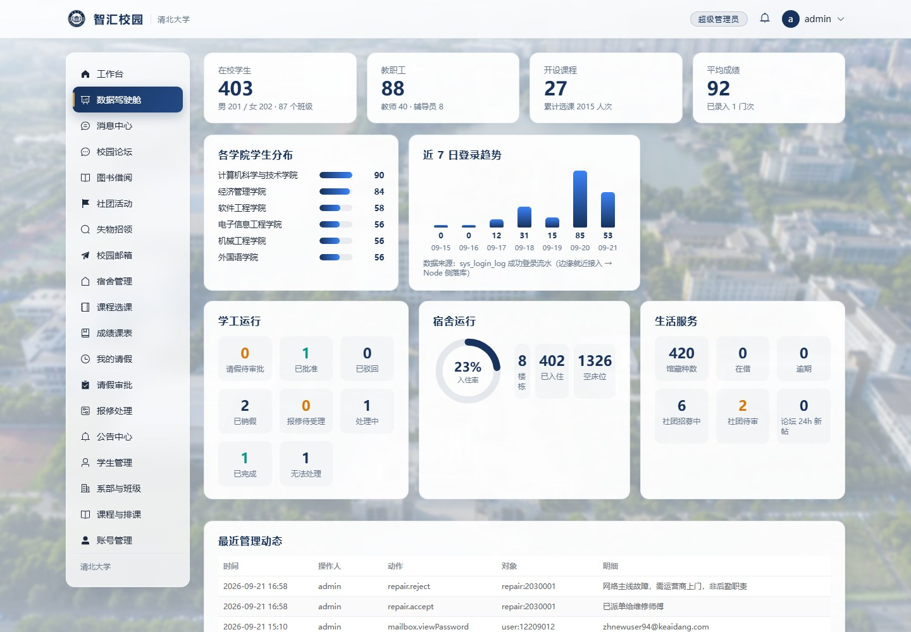
</p>

### 2.4 管理端

账号管理（统一身份：账号 / 姓名 / 学号 / 角色 / 有效期 / 数据范围）与宿舍管理（楼栋总览 + 房间床位分配，含性别约束与占用进度）。

<p align="center">
  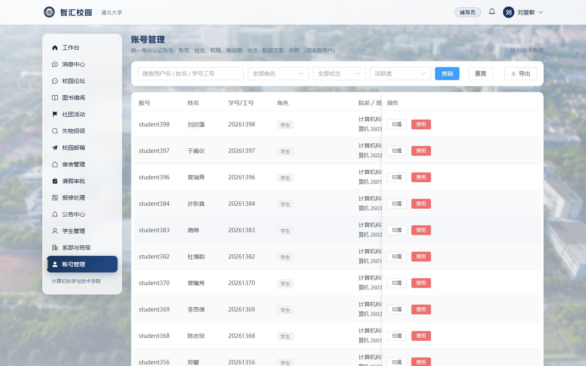
  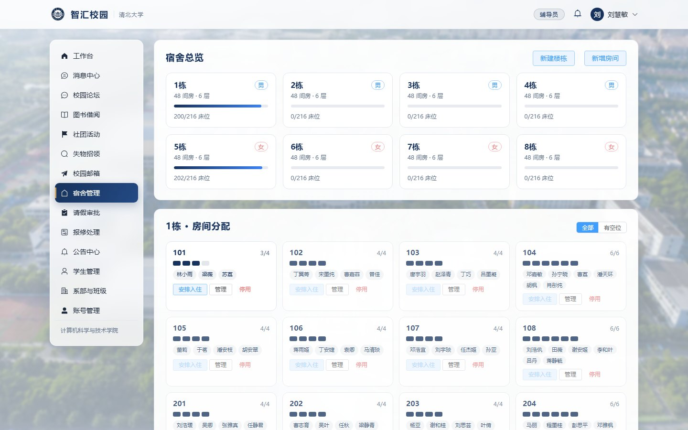
</p>

学工审批与报修工单（受理 / 完成 / 无法处理 三态流转，含原因与通知）。

<p align="center">
  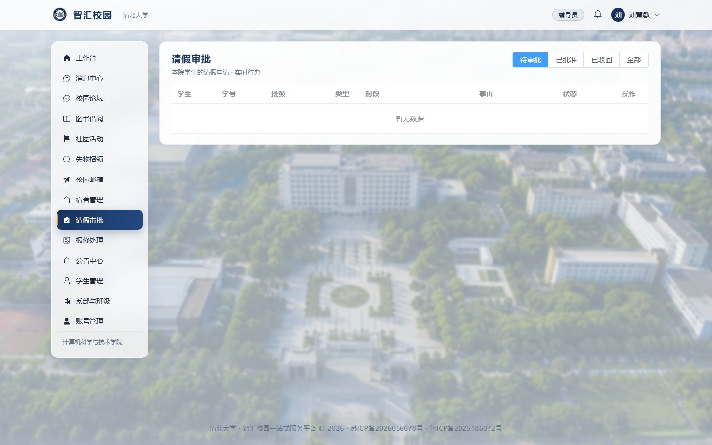
  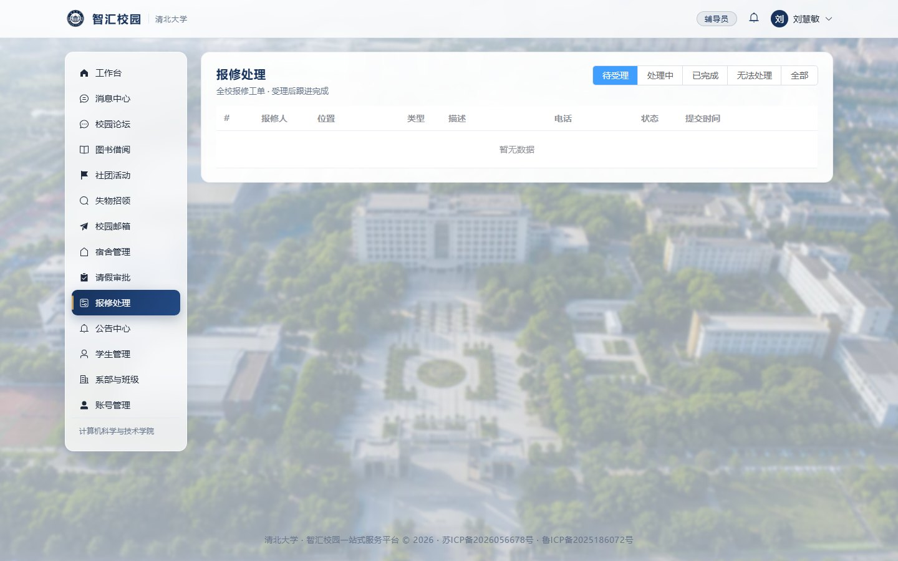
</p>

### 2.5 教务与生活服务

学生端选课与成绩课表、图书借阅、校园论坛。

<p align="center">
  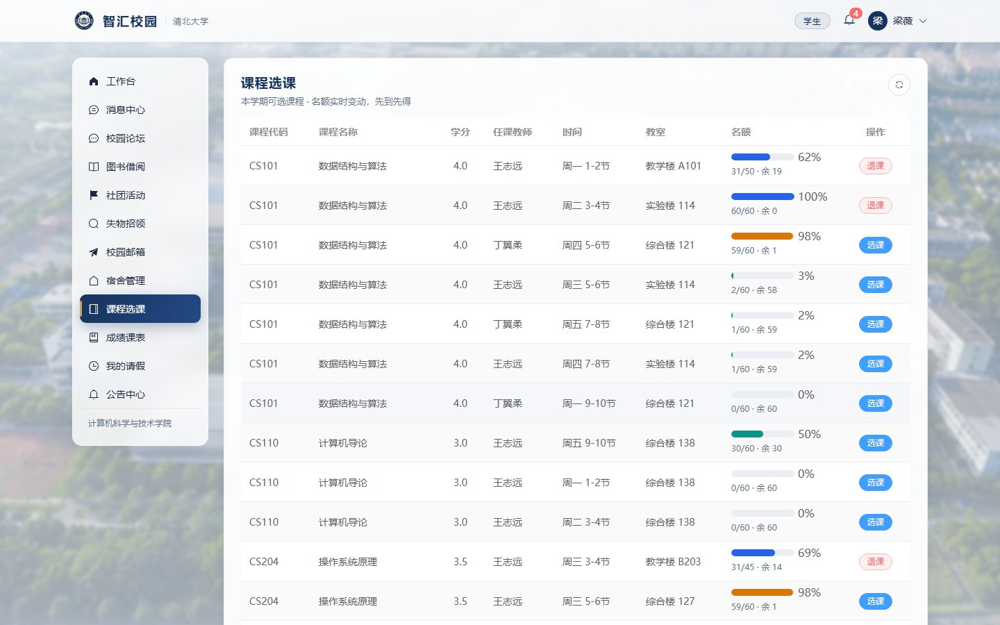
  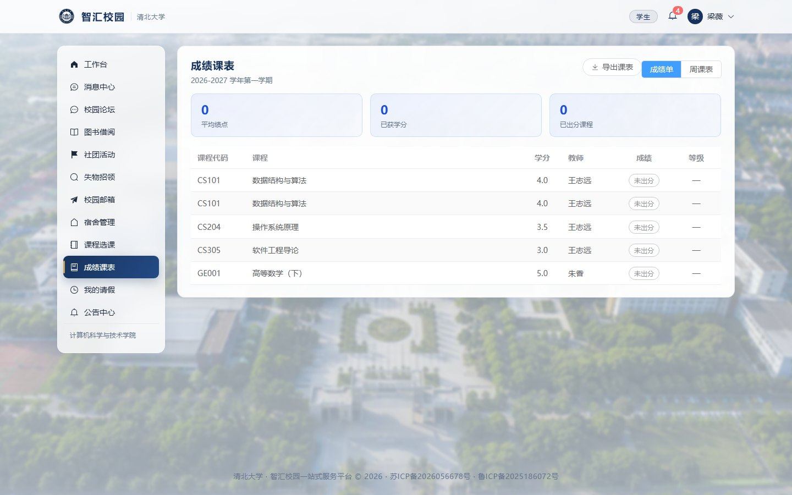
</p>

<p align="center">
  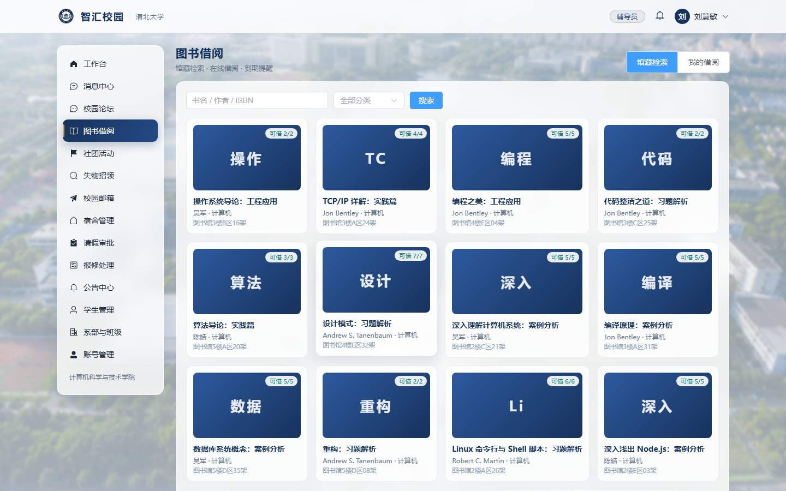
  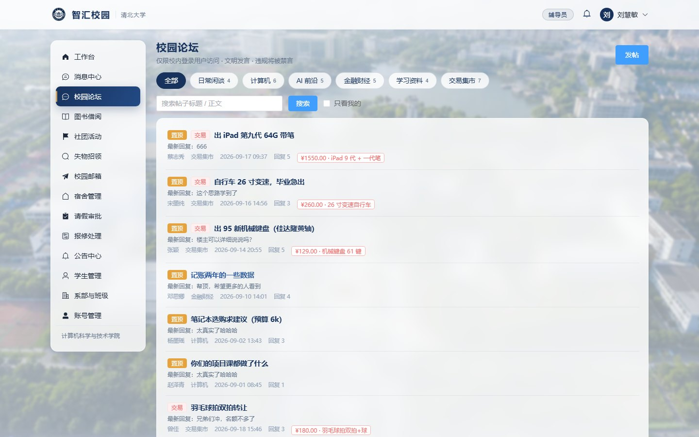
</p>

### 2.6 登录与站内信

<p align="center">
  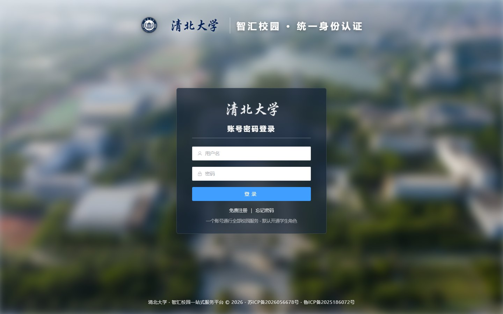
  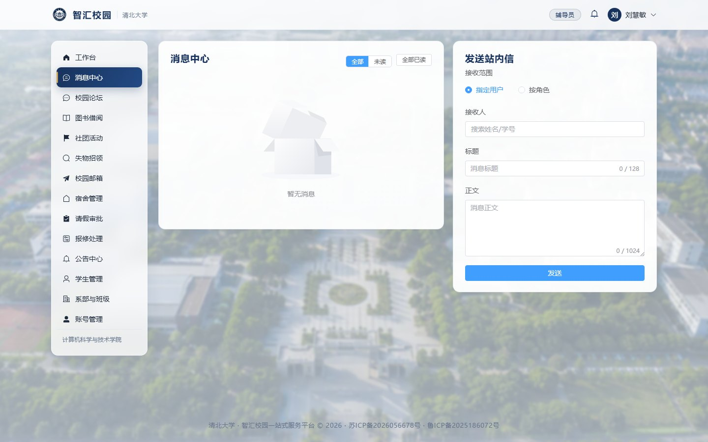
</p>

---

## 三、功能清单

### 3.1 五个角色

| 角色 | 代码 | 职责范围 |
|---|---|---|
| 学生 | `student` | 选课与退改选、成绩与课表查询、请销假申请、我的宿舍与报修、图书借阅、社团报名、论坛、校园邮箱 |
| 教师 | `teacher` | 我的课程、成绩录入、社团报名审核 |
| 辅导员 | `counselor` | **本院数据范围**：请假审批、报修受理、宿舍分配与退宿、学生名册、系部班级、公告发布 |
| 校领导 | `leader` | 数据驾驶舱（全校只读） |
| 超管 | `admin` | 全部模块 + 账号与角色管理、部门管理、课程与排课 |

> 权限模型是 **RBAC + 数据范围双维**：角色决定"能做哪些操作"，数据范围（`all` / `dept` / `self`）决定"能看哪些数据"，两者在服务端 SQL 层强制拼接，前端过滤仅作展示。

### 3.2 功能域

| 功能域 | 主要能力 |
|---|---|
| **统一认证** | 邮箱验证码注册、登录、忘记密码（自助重置）、**登录后自助修改登录密码**、双令牌（Access + Refresh）续期、退出登录 |
| **工作台** | 角色化功能入口、个人名片、校园邮箱卡片、常用资源聚合 |
| **教务 · 课程与排课** | 课程库、教学班、周次/节次/教室排课、教师任教分配 |
| **教务 · 选课** | 名额实时可见、防重复选课、**选课时段冲突检测**、退改选、并发防超卖 |
| **教务 · 成绩** | 教师成绩录入、绩点计算、学生成绩与周课表查询 |
| **学工 · 请销假** | 请假申请、辅导员审批（通过/驳回）、销假闭环、审批结果自动通知 |
| **学工 · 公告** | 公告发布与查阅，按数据范围隔离 |
| **宿舍管理** | 楼栋/房间/床位三级模型、**性别楼栋约束**分配、一人一在住、退宿留痕、报修工单（待受理 / 处理中 / 已完成 / 无法处理） |
| **校园邮箱** | 真实域名邮箱开通、站内通知、对外收发（每日配额）、管理员批量管理与审计 |
| **图书馆** | 图书建档、借阅/归还、在借与到期跟踪、馆藏统计 |
| **失物招领** | 拾获/遗失信息发布、状态跟踪、图片上传 |
| **社团活动** | 招新活动发布、学生预约报名、教师审核、名额管理 |
| **校园论坛** | 版块与帖子、回帖、置顶/关闭、二手交易板块（含商品与议价信息） |
| **站内信与通知** | 系统消息收发、审批/受理结果**自动推送**、顶栏未读铃铛轮询 |
| **数据驾驶舱** | 21 项并发聚合：用户规模、各学院分布、登录趋势、教务概况、学工四态、宿舍入住率、生活服务、最近管理动态 |
| **运维与审计** | 操作日志（`sys_op_log`）、登录流水、错误留痕、数据一致性体检脚本 |

---

## 四、技术栈

| 层 | 选型 | 说明 |
|---|---|---|
| 前端 | **Vue 3** + **Element Plus**（按需引入）+ **Pinia** + **Vue Router** | 24 个页面，路由懒加载；EP 按需打包，最大 chunk 1088KB → 172KB |
| 富文本与安全 | DOMPurify（内容消毒）、lucide + Element Plus 图标 | 论坛/公告等用户内容全量消毒，防 XSS |
| 边缘层 | **EdgeOne Edge Functions** + KV | 静态分发、边缘缓存、轻量统计端点（无 DB 依赖） |
| 服务层 | **EdgeOne Node Functions** | 业务 API、事务、统一鉴权、DB 流水限流 |
| 数据库 | **TiDB Cloud Serverless**（MySQL 兼容） | 33 张表，强一致事务；连接走 TLS |
| 外部集成 | 蓝沁邮件开放 API（校园邮箱收发） | 可选，未配置时邮箱模块自动降级提示 |
| 测试 | Vitest（单测）+ ESLint（flat config）+ 自研线上 e2e | `npm run check` 一条命令四段 |
| 部署 | EdgeOne Pages：Git 推送 → 自动构建部署 | 见 §7 |

---

## 五、系统架构

### 5.1 云边协同三层架构

<p align="center">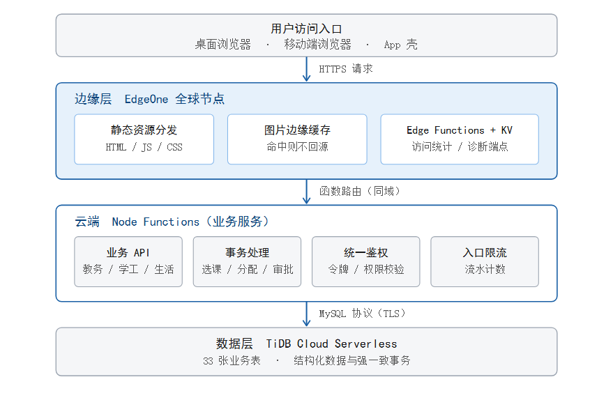</p>

| 层 | 组成 | 形态 | 需要运维什么 |
|---|---|---|---|
| **边缘层** | 全球 3200+ 节点：静态资源 CDN、图片边缘缓存、Edge Functions（KV 统计/诊断） | 边缘 Serverless | 无 |
| **云端** | Node Functions（业务 API、事务、统一鉴权、入口限流）+ TiDB Serverless | 云端 Serverless | 无 |
| **数据层** | 33 张业务表、结构化数据与强一致事务 | 托管数据库 | 无 |

### 5.2 EdgeOne 双运行时分工

平台提供两类运行时，能力边界差异显著——这是本项目架构设计的**实测依据**，而非纸面推演：

<p align="center">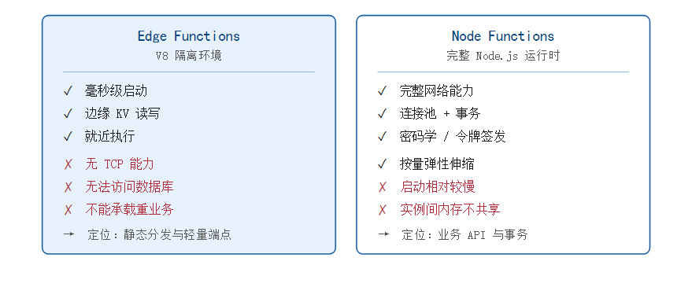</p>

| | Edge Functions | Node Functions |
|---|---|---|
| 运行形态 | V8 沙箱，边缘节点 | 完整 Node 运行时，区域节点 |
| 可访问 | 静态资源、KV、外部 HTTP | **MySQL/TCP**、完整 npm 生态 |
| 延迟 | 毫秒级（就近） | 常规 |
| 本项目用途 | 访问统计计数、诊断端点 | 全部业务 API、事务、限流 |

> **一条重要的实测结论**：原设计拟做"边缘限流网关"（边缘 KV 限流 + 回源代理），实测发现**边缘函数的同域 fetch 子请求走"节点缓存 → 静态源站"，不进入函数路由**，代理架构在本平台不可行，遂回滚为"边缘只放无状态、无 DB 依赖、容忍最终一致的能力"。这段"设计 → 实测 → 推翻 → 修正"的过程与判据详见 `docs/ARCHITECTURE.md`。

### 5.3 功能模块结构

<p align="center">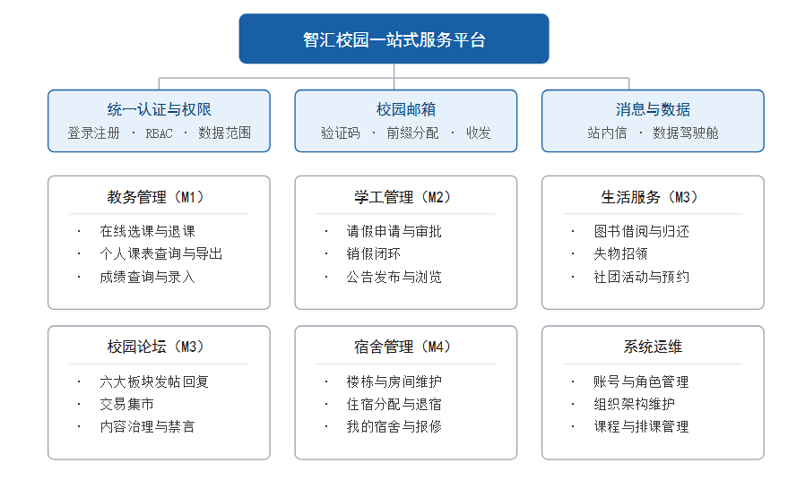</p>

### 5.4 关键设计

**① 权限三层防线**

```
第一层  前端路由守卫   登录态 + meta.roles，未登录带 redirect 回跳
第二层  requireRoles   角色**实时查库**（不信 JWT 内角色 → 撤权即时生效）
第三层  dataScope      数据范围 SQL 层强制拼接 WHERE（all / dept / self）
```

管理端写操作全部落 `sys_op_log` 审计；防自锁（不能禁用自己、不能摘自己的超管角色）。

**② 选课名额的并发一致性**

用**条件更新 + 受影响行数判定**（`UPDATE ... SET taken = taken + 1 WHERE id = ? AND taken < capacity`），而非应用层"先查后写"：

| 方案 | 为什么不选 / 选 |
|---|---|
| 悲观锁（`SELECT FOR UPDATE`） | Serverless 下连接持有时间长，易触发函数超时与连接数上限 |
| 乐观锁（版本号重试） | 热点课程重试循环退化严重，实际吞吐反而更低 |
| **条件更新 + affectedRows** ✅ | 单条原子语句，数据库保证一致性，无重试风暴 |

配套唯一键占位防重复选课，并做**时段冲突检测**（节次区间重叠判定）。线上并发压测零超卖。

**③ 通用审批流引擎**

`flow_instance`（业务走到哪）+ `flow_node`（每节点处理角色与留痕）两表驱动，业务零侵入：新增审批类业务只需建业务单据表 + 插实例 + 插节点，**不写流程代码**；处理人按"角色 + 数据范围"实时匹配，杜绝指定死处理人。

> **边界（主动划清）**：报修、社团报名属**单节点闭环**（语义是"受理/完成"而非"批准/驳回"），刻意采用状态机而非审批流。判据表见 `docs/DATABASE.md`。

**④ 时间口径统一（UTC 库内 + 展示层单一入口）**

全库时间以 **UTC 墙钟**落库，驱动层时区对齐 `'Z'`；前端展示统一走 `src/utils/time.js` 的 `fmtTime()/fmtAgo()`，禁止手工字符串截断（否则 Date 序列化会整体偏 8 小时）。用户输入的日历时间（如请假起止）在落库前显式转 UTC。

**⑤ 认证与令牌**

Access Token（无状态 JWT，2 小时）+ Refresh Token（**哈希后入库**，可吊销）双令牌。改密码、重置密码后**吊销该用户全部刷新令牌**——改密即视为凭据可能已泄露。

**⑥ 数据库连接韧性**

禁用 mysql2 预编译协议（TiDB Serverless 代理偶发 `malform packet error`），统一文本协议占位符转义；`query()` 内置瞬时错误自动重试（换连接最多 2 次）；随机 500 同步落库供远程诊断（线上无控制台）。

---

## 六、数据库设计

**33 张表，11 个 schema 文件**（`database/schema-001` ～ `schema-011`），按域组织、可增量迁移：

| 文件 | 域 | 内容概要 |
|---|---|---|
| `schema-001-auth.sql` | 认证与权限 | 用户、角色、用户角色、刷新令牌、登录流水、邮箱验证码、操作日志 |
| `schema-002-base.sql` | 基础数据 | 部门、班级、学期等公共维度 |
| `schema-003-edu.sql` | 教务 | 课程、教学班、选课记录、成绩 |
| `schema-004-affair.sql` | 学工 | 请假、报修、审批流实例与节点、公告 |
| `schema-005-org.sql` / `006-admin-depts.sql` | 组织 | 院系与辅导员数据范围绑定 |
| `schema-007-campus-email.sql` / `008-mail-sent.sql` | 校园邮箱 | 邮箱账号字段、发信流水 |
| `schema-009-m3-modules.sql` | 生活服务 | 图书与借阅、失物招领、社团招新与报名、论坛帖子与回帖、图片 blob |
| `schema-010-dorm.sql` | 宿舍管理 | 楼栋、房间、住宿分配（含性别约束与"一人一在住"生成列唯一键） |
| `schema-011-message.sql` | 站内信 | 系统消息与已读状态 |

> 完整字段级说明（含索引、约束、设计取舍）见 **[`docs/DATABASE.md`](docs/DATABASE.md)**，该文档是数据库的单一事实来源，改表前必读。

两个值得一提的表设计：

- **`dorm_assignment` 的"一人一在住"**：用生成列 `active_flag = IF(check_out_at IS NULL, 1, NULL)` + `UNIQUE(user_id, active_flag)` 实现——利用 NULL 不参与唯一性判定的特性，既保证在住唯一，又允许保留多条历史退宿记录。
- **图片存储**：当前走 `sys_blob`（LONGBLOB）+ token 外链，已在 `blob.js` 预留切面，接入对象存储时只需改 URL 生成逻辑。

---

## 七、部署方式

### 7.1 部署架构

```
Git 仓库 ──push──▶ EdgeOne Pages（自动构建）──┬──▶ 静态产物 → 全球 CDN 边缘节点
                                             ├──▶ edge-functions/  → 边缘运行时
                                             └──▶ node-functions/  → Node 运行时 ──TLS──▶ TiDB Cloud
```

无需自备服务器、无需容器、无需 Nginx；构建配置声明在仓库根目录的 `edgeone.json`（含 Node 版本、SPA 回退重写、缓存与安全响应头）。

### 7.2 前置准备

| # | 依赖 | 说明 |
|---|---|---|
| 1 | **EdgeOne Pages 账号** | 提供静态托管 + 双运行时 + KV |
| 2 | **TiDB Cloud Serverless 实例** | 免费额度足够毕设量级；创建后下载 CA 证书（TLS 必需，`rejectUnauthorized: true`） |
| 3 | **蓝沁邮件开放 API**（可选） | 校园邮箱模块依赖；不配置则该模块降级为提示，其余功能不受影响 |
| 4 | Node.js ≥ 20 | 与 `edgeone.json` 中 `nodeVersion` 保持一致 |

### 7.3 环境变量

生产环境变量在 **EdgeOne Pages 控制台 → 项目设置 → 环境变量** 配置；本地开发写入仓库根目录 `.env`（**已在 `.gitignore` 中，严禁入库**）。

| 变量 | 必需 | 用途 |
|---|---|---|
| `DB_HOST` / `DB_PORT` / `DB_USER` / `DB_PASSWORD` / `DB_NAME` | ✅ | TiDB 连接信息 |
| `DB_CA_PATH` | 云端✅ | TiDB 根证书路径（仓库提供 `cert/isrgrootx1.pem` 示例；未设置时按系统信任链校验） |
| `JWT_SECRET` | ✅ | 双令牌签名密钥（HS256），泄露等于全站身份可伪造 |
| `LANQIN_API_KEY` / `LANQIN_BASE_URL` / `LANQIN_DOMAIN_ID` | 邮箱功能✅ | 邮件服务接入 |
| `LANQIN_SYSTEM_MAILBOX_ID` / `LANQIN_SYSTEM_ADDRESS` / `LANQIN_SEND_MAILBOX_ID` | 邮箱功能✅ | 系统发件邮箱与归属 |
| `LANQIN_OWNER_USER_ID` | 邮箱功能✅ | 邮箱归属主账号（缺失会导致发信接口归属校验失败） |

### 7.4 数据库初始化

```bash
# 1) 配置 .env（必须包含 DB_* 与 DB_CA_PATH）
# 2) 按文件名顺序执行全部 schema（幂等，可重复运行）
python scripts/run-schema.py

# 或逐条增量迁移（推荐用于已上线的库）
node scripts/migrate.mjs database/schema-010-dorm.sql
```

schema 文件均为**幂等**（`CREATE TABLE IF NOT EXISTS` / 存在则跳过），可安全重复执行。

### 7.5 部署到 EdgeOne Pages

1. 将仓库推送到 Git 平台（GitHub / Gitee / 自建 GitLab 均可）；
2. EdgeOne Pages 控制台 → **新建项目** → 导入该仓库；
3. 构建配置：框架预设选 **Vite**，构建命令 `npm run build`，输出目录 `dist`（与 `edgeone.json` 一致，通常自动识别）；
4. 配置 §7.3 的全部环境变量；
5. 点击部署，等待首次构建完成（约 2～3 分钟），获得访问域名；
6. 首次部署后灌入演示数据（见下）；
7. **后续更新**：`git push` 即触发自动构建部署，无需任何手动操作。

```bash
# 演示数据（首次部署后执行，均为幂等脚本）
node scripts/seed-admin-staff.mjs   # 管理员与教职工账号
node scripts/seed-demo.mjs          # 院系、班级、课程、选课、成绩
node scripts/seed-m3.mjs            # 图书、失物、社团、论坛
node scripts/seed-dorm.mjs          # 楼栋房间与 403 名学生的性别/宿舍分配

# 建号与授权
node scripts/grant-role.mjs <用户名> <角色> [--create] [--reset] [--name=姓名] [--no=学工号]
```

> ⚠ **部署生效需 2.5～3 分钟**。部署窗口期内新旧函数会短时混跑，可能返回"诡异 500"（`Body has already been read` 等平台瞬态），**冒烟验证请等满 3.5 分钟再跑**。

### 7.6 本地开发

```bash
npm install
npm run dev      # 纯前端调试（Vite，5173）
```

纯 Vite 模式**不包含**云函数运行时，`/api` 请求需要一个后端来源，二选一：

- **推荐**：使用 EdgeOne CLI 的本地开发模式（`edgeone pages dev`），可同时挂载 `edge-functions/` 与 `node-functions/`，与线上行为一致；
- 或把前端指向已部署环境（改 `src/api/request.js` 的 base，或自行在 `vite.config.js` 的 `server.proxy` 中配置转发）。

### 7.7 回滚

部署由 Git 分支驱动，回滚即回退提交：

```bash
git revert <commit>          # 生成反向提交（保留历史，推荐）
# 或
git reset --hard <tag> && git push -f origin main   # 硬回退到某个 tag
```

EdgeOne 会按新 HEAD 自动重新部署，约 3 分钟回到目标状态。仓库中保留了关键节点的 tag（如 `pre-home-redesign`）作为还原点。

---

## 八、测试与质量保障

一条命令跑完全部检查：

```bash
npm run check        # = lint → 单测 → 库体检 → 线上 e2e（四段）

npm run lint         # ESLint（仅错误级规则，拦截真实缺陷而非风格噪音）
npm test             # Vitest 单测
npm run check:db     # 数据库 SQL 冒烟 + 数据一致性体检 + 项目盘点（只读）
npm run check:e2e    # 线上端到端冒烟（只读，可反复重跑）
```

| 层次 | 覆盖内容 | 规模 |
|---|---|---|
| **单元测试** | 时间口径（含 UTC 偏移专项）、权限三层防线与错误码、选课时段冲突算法、宿舍性别约束、HTTP body 解析、口令强度规则 | **80 用例** |
| **数据库体检** | 18 类数据一致性核对：孤儿记录、重复在住、房间占用数与实际入住、图书可用数与在借数、住宿与楼栋性别匹配等 | 全 0 不一致 |
| **线上 e2e** | 四角色登录 + 全模块端点 + **越权边界**（学生访问管理端必须 403）+ 历史缺陷回归 | **56 项断言** |
| **静态检查** | ESLint flat config（含 `vue/no-ref-as-operand` 等能拦住真实缺陷的规则） | 0 告警 |
| **安全** | 依赖漏洞（生产依赖 0）、SQL 全参数化、写端点 100% 鉴权、CSP/HSTS 等安全响应头 | — |
| **移动端** | 24 个路由零横向溢出 + 表格列可读性双断言巡检 | 全通过 |

几项刻意的工程取舍：

- **ESLint 只开错误级规则，不引入格式规则** —— 项目已有既定风格，格式规则必然产生数百条历史噪音，最终结果是没人再看 lint；
- **e2e 全程只读** —— 可以随时反复执行，不污染演示数据，答辩前可高频彩排；
- **对已知平台瞬态做定向重试** —— 仅对 EdgeOne `Body has already been read` 这一种错误消息重试一次，其它 500 一律判失败，不让重试掩盖真实缺陷。

项目体检报告（含技术债分级与整改建议）见 [`docs/AUDIT-2026-09-21.md`](docs/AUDIT-2026-09-21.md)。

---

## 九、演示账号

| 账号 | 角色 | 说明 |
|---|---|---|
| `admin` | 超管 + 学生 | 密码由管理员自行设定（**生产环境请勿使用弱口令**） |
| `teacher01` | 教师 | 任教 3 个教学班，可录入成绩 |
| `counselor01` | 辅导员 | 计算机科学与技术学院（本院数据范围） |
| `student004` | 学生 | 有借阅/社团/论坛数据，可演示完整学生链路 |
| `student01` | 学生 | 已有选课与成绩数据，可演示成绩查询 |

其余账号初始口令统一为 `Zhihui@2026`。**所有演示账号仅用于毕业设计答辩演示，正式环境应全部重置或删除。**

---

## 十、开发文档索引

`docs/` 目录是项目的记忆体，任何协作者（包括 AI 会话）开工前请按序阅读：

| 文档 | 内容 |
|---|---|
| [`PRD.md`](docs/PRD.md) | 需求分析、功能清单、验收标准、明确的不做清单 |
| [`ARCHITECTURE.md`](docs/ARCHITECTURE.md) | 总体架构、技术选型 ADR、平台行为实测结论 |
| [`DATABASE.md`](docs/DATABASE.md) | **数据库单一事实来源**：33 张表字段、约束与设计取舍 |
| [`API.md`](docs/API.md) | 接口约定、端点清单、错误码表、鉴权口径 |
| [`CONVENTIONS.md`](docs/CONVENTIONS.md) | 代码与协作规范 |
| [`HANDOVER.md`](docs/HANDOVER.md) | 交接文档：代码地图、演示账号、交付流程、**35 条踩坑铁律** |
| [`PROGRESS.md`](docs/PROGRESS.md) | 进度、变更记录与剩余项 |
| [`AUDIT-2026-09-21.md`](docs/AUDIT-2026-09-21.md) | 全项目体检报告：缺陷修复、健康确认、技术债分级 |
| [`论文要点.md`](docs/论文要点.md) | 论文核心贡献梳理与章节篇幅建议 |
| [`RESEARCH-*.md`](docs/) | 行业与功能架构调研（商用校园平台对比） |

---

## 说明

本项目为毕业设计作品，用于教学与答辩演示。代码中所有校园名称、人员姓名、学号、邮箱等均为虚构演示数据；生产部署请务必自行配置独立的数据库、密钥与账号体系。
